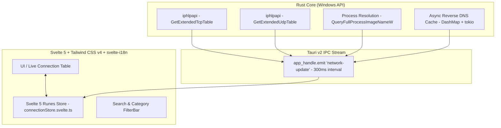

# 🛡️ NetWatch

> **Real-time outbound network connection monitor for Windows. Fast, driverless, and open-source.**

NetWatch is a modern, lightweight desktop application designed for Windows that monitors every outbound TCP & UDP socket connection in real time. It resolves remote IPs to domains, identifies the executable path, and displays bandwidth usage with zero bloat.


---

## ✨ Features

- ⚡ **Zero Drivers Required**: Uses native Windows `iphlpapi.dll` and `tokio` async tasks. No Npcap or kernel extensions needed.
- 🚀 **Ultra Lightweight**: Consumes less than 40 MB RAM and <1% CPU.
- 🌐 **Async Reverse DNS**: Automatic background hostname resolution (`142.250.184.206` -> `api.google.com`) with lock-free `DashMap` caching.
- 💻 **Process Inspection**: Maps every open connection to its PID, executable path, and native icon.
- 📊 **Real-Time Bandwidth Meters**: Dynamic sparkline velocity charts and live socket statistics.
- 🔍 **Instant Search & Filtering**: Filter by active sockets, raw IPs, or new processes.
- 🌍 **Internationalization (i18n)**: Instant language switching (English & Spanish).
- 🎨 **Cyber Dark Glassmorphism UI**: Beautiful, responsive interface created with Svelte 5 & Tailwind CSS v4.

---

## 🏗️ Architecture Overview



---

## 🛠️ Development & Building

### Prerequisites

- [Node.js](https://nodejs.org/) (v18+)
- [Rust](https://www.rust-lang.org/) (v1.75+)
- Windows 10 / 11 SDK

### Running Locally

```bash
# Clone the repository
git clone https://github.com/alfredgabriel/NetWatch.git
cd NetWatch

# Install dependencies
npm install

# Run Tauri development mode
npm run tauri dev
```

### Compiling Standalone Production Binary

```bash
npm run tauri build
```

The compiled standalone executable and installer `.msi` / `.exe` will be generated in `src-tauri/target/release/bundle/`.

---

## 📄 License

This project is licensed under the **MIT License** - see the [LICENSE](LICENSE) file for details.
